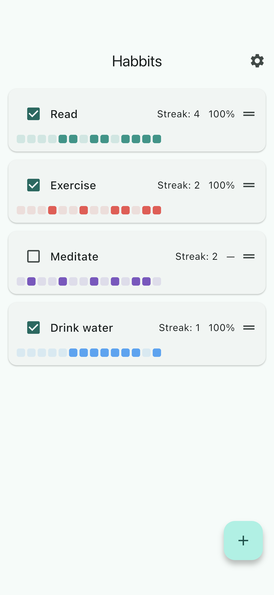
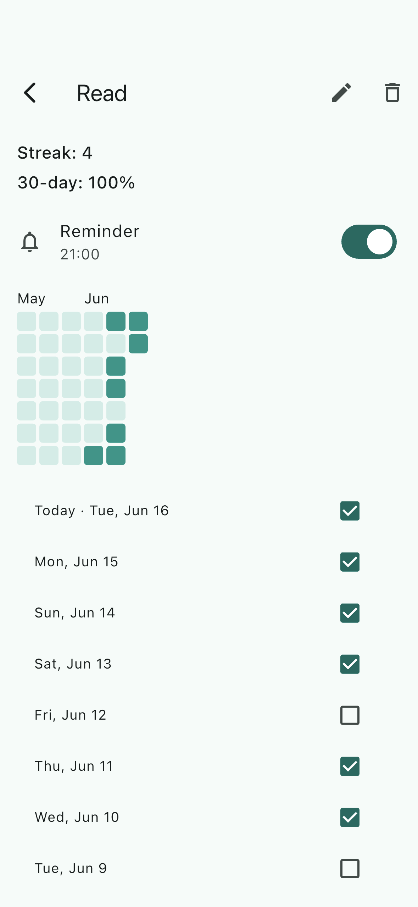
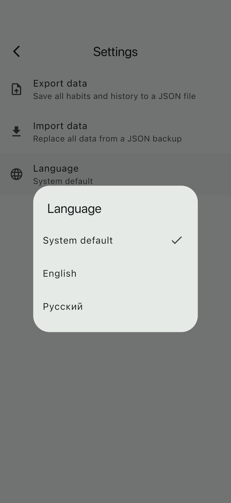
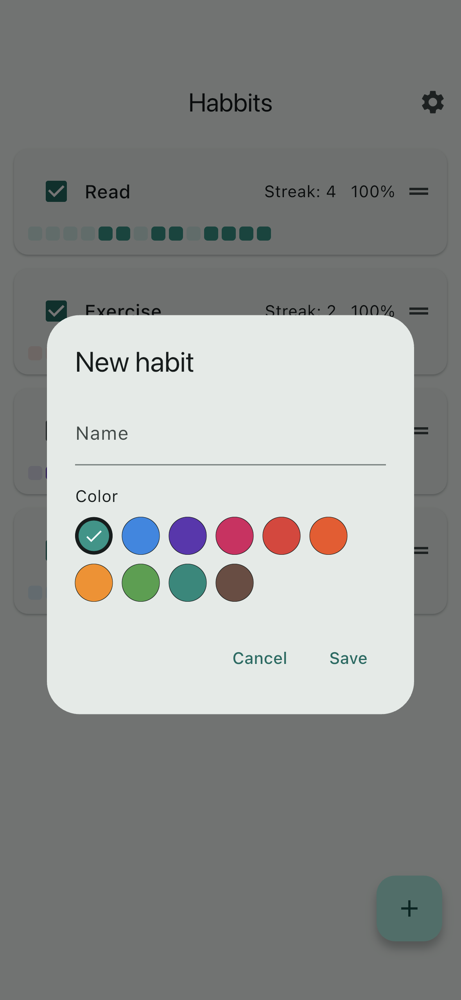
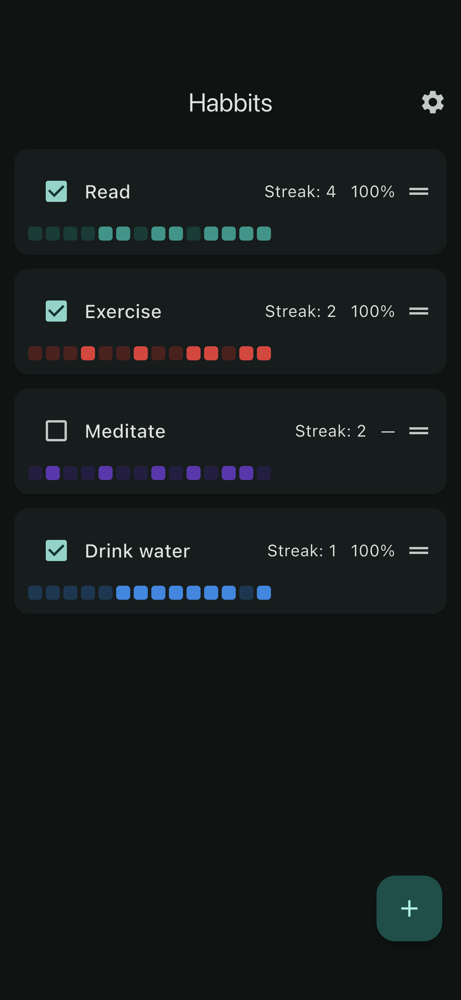
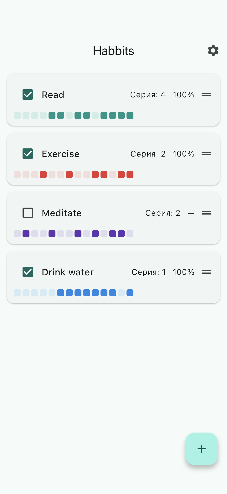

# Habbits

A **local-first, cross-platform habit tracker. Your data, on your device.**

[](https://github.com/quotidianlabs/habbits/releases/latest)
[](https://www.rustore.ru/catalog/app/io.github.quotidianlabs.habbits)
[](https://github.com/quotidianlabs/habbits/actions/workflows/ci.yml)
[](https://github.com/quotidianlabs/habbits/actions/workflows/ci.yml)
[](LICENSE)


Habbits is a small, fast habit tracker built around two ideas: **you own your
data** (everything lives in an on-device SQLite database — no account, no
backend) and **deleting a habit is frictionless**. iOS + Android, English and
Russian.

| Home | Detail | Settings |
|---|---|---|
|  |  |  |

| Color picker | Dark theme | Home (Русский) |
|---|---|---|
|  |  |  |

## Features

- ✅ Daily check-off with current-streak tracking
- 📅 6-week heatmap + recent-days list with retroactive editing
- ⏰ Per-habit reminders (on-device local notifications)
- ↕️ Drag-to-reorder the home list
- 💾 JSON export / import — your data is portable
- 🌍 English + Russian, following the device locale with an in-app override
- 🎨 Material 3 with light & dark themes (follows the device, or pick one)
- 🌈 Per-habit color from a curated palette, set on create or edit
- 📱 iOS and Android from one Flutter codebase

## Architecture

Layered MVVM with Riverpod: **UI** (views + per-feature view models) →
**domain** (pure functions + models) → **data** (repositories over a Drift
SQLite database, notifications, preferences). Generated code is committed.

The design and implementation history for every change lives in
[`planning/`](planning/) — see, e.g., the
[layered-architecture refactor](planning/changes/2026-06-15.01-architecture-refactor.md)
and [Russian-language support](planning/changes/2026-06-14.04-russian-language.md).

## Getting started

Requires [Flutter 3.44.2](https://flutter.dev). Then:

```bash
flutter pub get
flutter run
```

Generated `*.g.dart` (Drift, Riverpod, l10n) is committed, so a normal run needs
no code generation. After changing `@riverpod`/Drift code, regenerate with
`dart run build_runner build --delete-conflicting-outputs`.

## Development

This repo uses [`just`](https://github.com/casey/just):

```bash
just lint    # dart format + flutter analyze
just test    # flutter test (unit + widget)
```

The integration flow runs on a device/emulator:
`flutter test integration_test/critical_flow_test.dart`.

## License

[MIT](LICENSE) © 2026 quotidianlabs
